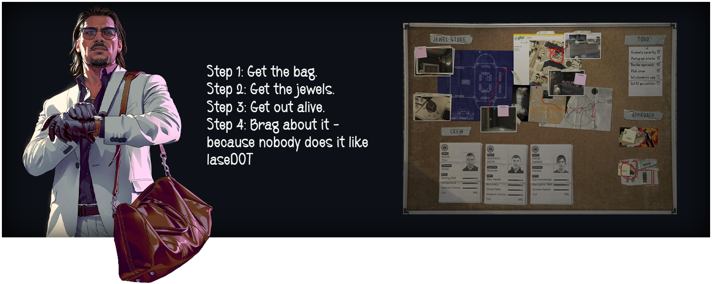

<!-- Header -->

<!-- Content -->
<h1 align="center">WELCOME TO THE HEIST

  
  
  
  
  
 

 

  
  
  
  
  
  

  
<h3 align="left">
- 🔭 I’m currently open to a new Job
 
- 🌱 I’m currently learning **Devops**

- 👨‍💻 All of my projects are available at [supun's workspace](http://supun.traditionalme.life)

- 💬 Ask me about **Java, Python, PHP and NodeJS**

- 📫 How to reach me **supunnanayakkara01@gmail.com**

- 📄 Know about my experiences [my experiences](http://supun.traditionalme.life/#resume)

- ⚡ Fun fact **I think I'm funny**

<h3 align="left">Languages and Tools:</h3>

- Backend

  

- Frontend

  

- Database

  

- Cloud Servers

  

- Tools

  

 

